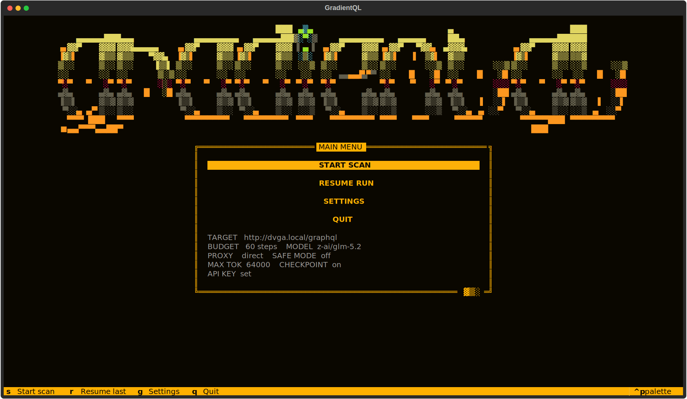
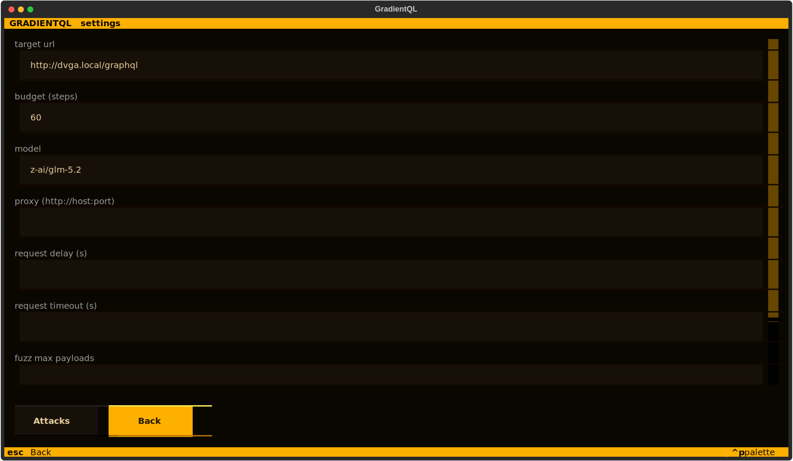
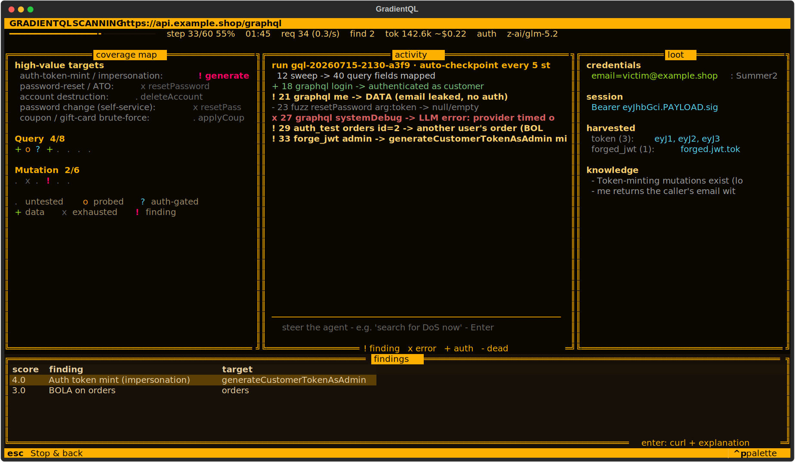
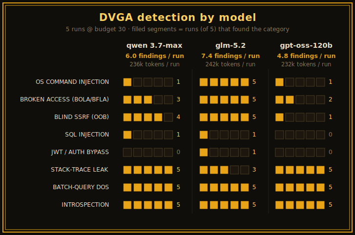

# GradientQL


GradientQL is a vibe powered GraphQL vulnerability scanner driven by a single language model. You
give it an endpoint and a model API key, and it runs the whole assessment on its own: it reads the schema,
registers and logs into an account when it needs one, and probes for access-control flaws,
injection, server-side request forgery, JWT forgery, request smuggling, CSRF, credential
brute-forcing, and denial of service.

<table>
  <tr>
    <td align="center" width="50%"><br><sub>Menu: set a target, then start a scan</sub></td>
    <td align="center" width="50%"><br><sub>Settings: budget, model, proxy, per-technique attacks</sub></td>
  </tr>
  <tr>
    <td align="center" colspan="2"><br><sub>Live dashboard during a scan: coverage map, activity feed, loot, and findings (illustrative data)</sub></td>
  </tr>
</table>

I started this about a year ago. The original plan was to buy a stack of Radeon MI50 GPUs and
fine-tune a model locally for GraphQL query generation, but that fell through. When Claude Opus 4.6
came out I revived the idea with cloud models instead. I was short on time, so I built almost all of
it with an LLM, while still working on something I find interesting: automated vulnerability
hunting.

The first version was an implementation of the PrediQL paper (arXiv:2510.10407). Out of curiosity I
replaced its control loop with a fully agentic one, and the results were interesting enough to keep
going. Early on I pointed it at a production GraphQL API inside a vulnerability disclosure program.
On an innocuous-looking query the model noticed a database error in the response and flagged it,
which turned into a blind SQL injection with real impact. It was reported through the program and
fixed.

## Scope and safety

Please note: this tool sends real attack traffic and has no built-in consent check. It targets
whatever URL you give it. Only run it against systems you are allowed to test: your own deployment,
a local target like DVGA, or something inside a bug bounty or disclosure scope you hold. Running it
against someone else's system without permission is likely illegal, and staying in scope is your
responsibility.

## Quickstart

**Requirements:** Python 3.10 or newer, an API key for a model on
[OpenRouter](https://openrouter.ai), and room for the machine-learning stack (FAISS,
sentence-transformers, and PyTorch) that the scanner uses for schema search.

**1. Install.** Clone the repository and install it in editable mode (or run everything in
containers, see [Docker](#docker)):

```
pip install -e ".[dev]"
```

**2. Set your model key.** The scanner uses the first key it finds, in this order: the `llm.api_key`
field in your settings file, a `config/api_key.local` file (gitignored), or the environment variable
named by `llm.api_key_env`, which defaults to `OPENROUTER_API_KEY`.

**3. Run a scan** against an endpoint you are allowed to test:

```
python -m gradientql --url https://your-target.example/graphql
```

To try it safely, scan the bundled
[DVGA](https://github.com/dolevf/Damn-Vulnerable-GraphQL-Application) target in one command with
Docker:

```
OPENROUTER_API_KEY=sk-... docker compose -f docker/docker-compose.yml up --build
```

Run `gradientql` with no `--url` in an interactive terminal to open the
[interactive interface](#the-interactive-interface) instead of plain logs.

## Results on DVGA

The scanner was evaluated against the
[Damn Vulnerable GraphQL Application](https://github.com/dolevf/Damn-Vulnerable-GraphQL-Application)
(DVGA), a standard intentionally-vulnerable GraphQL target.

**Setup.** Three models were each run five times (n = 5 per model). Every run introspected a freshly
restarted DVGA instance and executed under a per-run budget of 30 steps (one model call and at most
one request per step) with the default attack configuration. Every finding was mapped to DVGA's
published set of 21 named vulnerabilities and aggregated across the five runs. The model makes every
decision, so runs are non-deterministic and differ from one another.

| Parameter | Value |
|---|---|
| Target | DVGA (fresh instance per run) |
| Runs (n) | 5 per model |
| Budget per run | 30 steps |
| Models | `qwen/qwen3.7-max`, `z-ai/glm-5.2`, `openai/gpt-oss-120b` |
| Attack set | default (destructive `dos` off) |

**Results.** Mean findings per run: `z-ai/glm-5.2` 7.4, `qwen/qwen3.7-max` 6.0, `openai/gpt-oss-120b`
4.8. All three find the easy categories (introspection, batch queries, stack-trace leakage) in
essentially every run and separate on the multi-step authentication chains, where glm is strongest and
the small, fast gpt-oss model is weakest.

Each row below is one category over five runs at a 30-step budget; the filled segments are the runs
(out of five) in which that model found it.

<p align="center"></p>

DVGA lists 21 named vulnerabilities (OS command injection is counted as two variants). Three of them
(stored XSS, HTML injection, log injection) require a browser or access to the server logs and are
outside the reach of a black-box HTTP scanner. For the rest, the number of runs (out of five) in which
each model detected the category:

| Category | qwen 3.7-max | glm-5.2 | gpt-oss-120b |
|---|---|---|---|
| GraphQL introspection | 5 / 5 | 5 / 5 | 5 / 5 |
| Batch-query denial of service | 5 / 5 | 5 / 5 | 5 / 5 |
| Stack-trace / error leakage | 5 / 5 | 3 / 5 | 5 / 5 |
| Blind SSRF (out-of-band) | 4 / 5 | 5 / 5 | 1 / 5 |
| OS command injection | 1 / 5 | 5 / 5 | 1 / 5 |
| Broken access control (BOLA / BFLA) | 3 / 5 | 5 / 5 | 2 / 5 |
| SQL injection | 1 / 5 | 1 / 5 | 0 / 5 |
| JWT forge / auth bypass | 0 / 5 | 1 / 5 | 0 / 5 |
| GraphiQL interface, field suggestions | 0 / 5 | 0 / 5 | 0 / 5 |

Broken access control (BOLA / IDOR on unauthenticated destructive mutations and cross-user reads) is
not among DVGA's named challenges but is a real issue, so it is included above. The remaining
denial-of-service variants (deep recursion, resource-intensive, field duplication, aliases) were not
exercised because the destructive `dos` technique is off in the default configuration.

**Notes.**

- All three models detect introspection, batch queries, and stack-trace leakage in essentially every
  run; they differ on the auth-gated, multi-step vulnerabilities.
- glm is strongest there (OS command injection 5/5, broken access control 5/5, blind SSRF 5/5), qwen
  sits in the middle, and gpt-oss reaches them least often (1/5, 2/5, 1/5).
- gpt-oss is the cheapest and fastest of the three (a 30-step run finishes in about two minutes), at
  the cost of depth; qwen and glm trade speed for reach.

These figures reflect the default configuration at a 30-step budget. A larger budget or additional
enabled techniques would change them (see below).

**Token usage.** Cost depends on the model and provider, so only token counts are reported here. A
30-step run used roughly 236,000 ± 12,000 tokens on `qwen/qwen3.7-max`, 242,000 ± 18,000 on
`z-ai/glm-5.2`, and 232,000 ± 14,000 on `openai/gpt-oss-120b`, the bulk of it input, since the prompt
carries the full schema and running state each turn. The counts are similar because the prompt
dominates; the models differ mainly in speed and in the depth of what they find. A scan reports its
own token count live on the dashboard and in the final report.

### A larger-budget run

To show how coverage scales with budget, one run per model was performed with a 200-step budget and
the `dos` technique enabled; all other parameters matched the setup above.

| Model | Steps used | Findings | Distinct categories |
|---|---|---|---|
| `z-ai/glm-5.2` | 104 (self-terminated) | 15 | 9 |
| `qwen/qwen3.7-max` | 81 (self-terminated) | 10 | 4 |
| `openai/gpt-oss-120b` | 200 (full budget) | 9 | 6 |

The glm run went deepest: 15 findings across nine categories, including a broken-access-control cluster
across five fields (unauthenticated `deleteAllPastes`, cross-user read, edit, and delete of private
pastes, and `users`), OS command injection on two endpoints, SQL injection on two parameters, a forged
admin JWT via a weak signing secret, blind out-of-band SSRF, and audit-log disclosure. It reached JWT
forgery and the systematic access-control cluster that the 30-step runs did not. qwen self-terminated
earlier with 10 findings, adding arbitrary file write / path traversal and an aliases-based denial of
service. gpt-oss used its whole budget and still found the fewest (9), consistent with the 30-step
results: fast and cheap, but shallower on the multi-step chains.

These are single, non-deterministic runs, included to show that a larger budget translates into deeper
coverage rather than to establish a rate.

## Usage

### Running a scan

Add `--trace` to record everything the model did during the run. This is the main way to understand a
scan after it finishes:

```
python -m gradientql --url https://your-target.example/graphql --trace
```

The mode is chosen automatically: run `gradientql` with no `--url` in an interactive terminal and it
opens the [interface](#the-interactive-interface); pass `--url`, pipe or redirect the output, or add
`--no-tui`, and it prints plain logs. `--tui` forces the interface even with `--url` set, as long as a
terminal is attached. `--url` overrides the target set in the config file, and after installing, the
`gradientql` command runs the same thing as `python -m gradientql`.

### Command-line arguments

| Argument | Effect |
| --- | --- |
| `--url URL` | Target GraphQL endpoint. Overrides `target.url` from the settings file. |
| `--settings PATH` | Path to the settings file. Defaults to `config/settings.yaml`. |
| `--trace [PATH]` | Record every step's prompt, response, observations, and state to a `.jsonl` log and a matching `.md` digest. Bare `--trace` writes `output/agent_trace_<timestamp>.*`; pass a path or prefix to write elsewhere. |
| `-v`, `--verbose` | Print each step's full, untruncated thought and observations to the console (plain-log mode). |
| `--tui` | Force the interactive interface. Falls back to plain logs when no terminal is attached. |
| `--no-tui` | Force plain log output even in an interactive terminal. |
| `-h`, `--help` | Show usage and exit. |

### The interactive interface

Run `gradientql` with no arguments to open the TUI, which is composed of:

- A menu that shows the current target, budget, model, proxy, and whether an API key is set, with
  buttons to start a scan or open settings.
- A settings screen for the target URL, budget, model, proxy, request delay and timeout, and the
  fuzz payload cap, plus a submenu of per-technique attack toggles (injection, SSRF, denial of
  service, request smuggling, CSRF, JWT, brute force, and access-control testing).
- A live dashboard, shown once a scan starts. Before the scan runs it checks that the API key
  authenticates and stops with a clear message if the key is missing or rejected. During the run it
  updates in place: a stats line (step, elapsed time, request rate, findings, model), a coverage map
  of the schema, an activity feed of the model's decisions as they happen, a loot pane with any
  harvested credentials, the current session token, and recorded facts, and a table of findings. A
  steering box along the bottom lets you redirect the agent mid-scan (see
  [Steering the agent](#steering-the-agent)).

The screens are shown in the [gallery](#gradientql) near the top of this page. The coverage map marks
each root field as untested, probed, auth-gated, data, exhausted, or a finding, so you can watch the
attack surface fill in as the agent works.

The interface is keyboard- and mouse-driven; the active keys show in the footer.

- **Menu**: `s` starts a scan, `g` opens settings, `q` quits.
- **Settings and attacks**: edit the fields and switches; the Attacks button opens the per-technique
  toggles. `Esc` (or Back) saves and returns, and changes apply to the next scan.
- **Dashboard**: opens when a scan starts and updates in place. `Esc` stops the scan and returns to
  the menu.

### Steering the agent

The agent runs on its own, but you can redirect it while a scan is in progress. Whatever you send is
injected into the model's next prompt as an operator instruction that takes priority over its own
plan, and it is recorded in the trace. Use it to focus the run ("test the upload field for path
traversal"), flag a miss ("you skipped importPaste"), or change tack ("stop recon, try DoS now").

- **Interactive interface**: type into the steering box at the bottom of the dashboard and press
  Enter. The message shows in the activity feed as `operator: ...`.
- **Plain-log mode**: in an interactive terminal, type a line and press Enter at any point during
  the scan and it is picked up on the next step. This is disabled when input is piped or redirected.

A steering message stays in view for a few steps so the agent does not lose it mid-action.

## Configuration

Settings are written in YAML. `config/settings.yaml` is a template you copy and edit, and you can
point the scanner at a different file with `--settings`. Any key you leave out falls back to a
built-in default, so a config file only needs the values you want to change. The fields that
matter most:

```yaml
target:
  url: "https://your-target.example/graphql"
  headers: {}          # auth headers for an already-authenticated run
  csrf: { enabled: false }

http:
  proxy: ""            # route traffic through Burp or mitmproxy, e.g. "http://127.0.0.1:8080"
  delay: 0.0           # seconds between requests, for rate limiting
  verify_tls: true     # set false for an intercepting proxy or self-signed certs

llm:
  provider: "openrouter"
  attacker_model: "qwen/qwen3.7-max"

scanner:
  budget: 60           # the most steps a scan takes; each step is one model call and at most one request
  safe_mode: false     # one switch to disable the destructive techniques
  attacks:             # turn individual techniques on or off
    injection: true
    ssrf: true
    dos: false         # resource exhaustion, off by default because it can knock a target over
    jwt: true
    bola: true         # systematic BOLA/BFLA testing across identities
  oob: { enabled: true, provider: "interactsh", collaborator_domain: "oast.fun" }
```

The `http` block routes traffic through a proxy and sets timeouts and rate limiting, `safe_mode` and
the `attacks` map gate individual techniques, and `config/settings.yaml` documents every field with
its default.

To reach authenticated objects, which is where bugs like broken object-level authorization live,
the scanner needs a session. You can give it one by putting a valid token in `target.headers`, or
you can let it earn one itself through the signup, email confirmation, and login flow using the
`temp_mail` action.

## How it works

A scan is a short pipeline. The scanner introspects the schema, runs a quick check for common
misconfigurations, hands control to the model, waits for any out-of-band callbacks to arrive,
removes duplicate findings, and prints a report.

The middle step is where the work happens. On each turn the model is given a compressed view of
the situation: the schema, a summary of what it has already tried, the facts it has recorded, and
any credentials or tokens it has harvested. It replies with one JSON action, for example:

```json
{"thought": "...", "action": "sweep", "args": {}, "learned": "optional note", "verdict": {}}
```

The `learned` and `verdict` fields are optional and can be attached to any action. They are how
the model writes to its own memory. `learned` records a fact worth keeping, and `verdict` marks a
field as dead, open, or exploited. The program also classifies each response on its own, but the
model's verdict takes priority, so the model stays in charge of judgment while a simple default
fills in when it stays silent.

The actions the model can take are `graphql`, `sweep`, `search_schema`, `fuzz`, `set_identity`,
`temp_mail`, `forge_jwt`, `oob_url`, `dos`, `smuggle`, `csrf`, `auth_test`, `batch_brute`, `visit`,
`note`, `report_finding`, and `done`. Between them they cover
reconnaissance, authentication (including registering an account, reading a confirmation email
from a disposable mailbox, and logging in), and the individual attack techniques.

## Docker

Two images are provided: `gradientql` (the scanner) and `gradientql-dvga` (a patched DVGA target with
the gevent concurrency fix baked in). The Compose file brings up DVGA and scans it in one command
(shown in the [Quickstart](#quickstart)). Full instructions, including scanning your own target from a
container, are in [docs/docker.md](docs/docker.md).

## Output

Everything the scanner writes goes under `output/`, which is ignored by git:

- `agent_trace_<timestamp>.jsonl` and the matching `.md` file, written when `--trace` is on. Each
  step records the exact prompt sent to the model, the raw reply, the parsed action, the
  observation fed back in, and a snapshot of the state. The `.md` file is the readable version.
- `vuln_stream.jsonl`, which holds the findings. They are written as they are confirmed, so a
  crash partway through a run does not lose them.

## Testing

```
python -m pytest -q
```

The test suite is fast and runs entirely offline.

## Limitations

There is no consent gate, and that is deliberate. Scoping is your responsibility, so read the note
near the top before you run anything.

Runs are not deterministic. The model drives, so two scans of the same target will differ, and
whether a bug is found depends on the model reasoning its way to it.

Some models refuse to attack a named live domain. When that happens the run stops after a few
refusals rather than spending the whole budget.

## Authorship

This project was written by Claude working under human direction. A person sets the goals, reviews
the output, and decides what ships, but most of the code, tests, and documentation are generated by
the model.

## License

MIT. See the LICENSE file.
