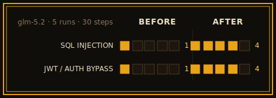

# Detection results

The full evaluation behind the summary in the [README](../README.md#evaluation).

The scanner was evaluated against the
[Damn Vulnerable GraphQL Application](https://github.com/dolevf/Damn-Vulnerable-GraphQL-Application)
(DVGA), a standard intentionally-vulnerable GraphQL target.

## Setup

Three models were each run five times (n = 5 per model). Every run introspected a freshly
restarted DVGA instance and executed under a per-run budget of 30 steps (one model call per step;
most actions make one request, battery actions up to ~16) with the default attack configuration.
Every finding was mapped to DVGA's published set of 21 named vulnerabilities and aggregated across
the five runs. The model makes every decision, so runs are non-deterministic and differ from one
another.

| Parameter | Value |
|---|---|
| Target | DVGA (fresh instance per run) |
| Runs (n) | 5 per model |
| Budget per run | 30 steps |
| Models | `qwen/qwen3.7-max`, `z-ai/glm-5.2`, `openai/gpt-oss-120b` |
| Attack set | default (destructive `dos` off) |

## Results

Mean findings per run: `z-ai/glm-5.2` 7.4, `qwen/qwen3.7-max` 6.0, `openai/gpt-oss-120b`
4.8. All three find the easy categories (introspection, batch queries, stack-trace leakage) in
essentially every run and separate on the multi-step authentication chains, where glm is strongest and
the small, fast gpt-oss model is weakest.

Each row below is one category over five runs at a 30-step budget; the filled segments are the runs
(out of five) in which that model found it.

The table below is the exact data behind that chart. DVGA lists 21 named vulnerabilities (OS command
injection is counted as two variants). Three of them (stored XSS, HTML injection, log injection)
require a browser or access to the server logs and are outside the reach of a black-box HTTP scanner.
For the rest, the number of runs (out of five) in which each model detected the category:

| Category | qwen 3.7-max | glm-5.2 | gpt-oss-120b |
|---|---|---|---|
| GraphQL introspection | 5 / 5 | 5 / 5 | 5 / 5 |
| Batch-query denial of service | 5 / 5 | 5 / 5 | 5 / 5 |
| Stack-trace / error leakage | 5 / 5 | 3 / 5 | 5 / 5 |
| Blind SSRF (out-of-band) | 4 / 5 | 5 / 5 | 1 / 5 |
| OS command injection | 1 / 5 | 5 / 5 | 1 / 5 |
| Broken access control (BOLA / BFLA) | 3 / 5 | 5 / 5 | 2 / 5 |
| SQL injection | 1 / 5 | 1 / 5 | 0 / 5 |
| JWT forge / auth bypass | 0 / 5 | 1 / 5 | 0 / 5 |
| GraphiQL interface, field suggestions | 0 / 5 | 0 / 5 | 0 / 5 |

Broken access control (BOLA / IDOR on unauthenticated destructive mutations and cross-user reads) is
not among DVGA's named challenges but is a real issue, so it is included above. The remaining
denial-of-service variants (deep recursion, resource-intensive, field duplication, aliases) were not
exercised because the destructive `dos` technique is off in the default configuration.

**Notes.**

- All three models detect introspection, batch queries, and stack-trace leakage in essentially every
  run; they differ on the auth-gated, multi-step vulnerabilities.
- glm is strongest there (OS command injection 5/5, broken access control 5/5, blind SSRF 5/5), qwen
  sits in the middle, and gpt-oss reaches them least often (1/5, 2/5, 1/5).
- gpt-oss is the cheapest and fastest of the three (a 30-step run finishes in about two minutes), at
  the cost of depth; qwen and glm trade speed for reach.

These figures reflect the default configuration at a 30-step budget. A larger budget or additional
enabled techniques would change them (see [A larger-budget run](#a-larger-budget-run) below).

## Token usage

Cost depends on the model and provider, so only token counts are reported here. A
30-step run used roughly 236,000 ± 12,000 tokens on `qwen/qwen3.7-max`, 242,000 ± 18,000 on
`z-ai/glm-5.2`, and 232,000 ± 14,000 on `openai/gpt-oss-120b`, the bulk of it input, since the prompt
carries the full schema and running state each turn. The counts are similar because the prompt
dominates; the models differ mainly in speed and in the depth of what they find. A scan reports its
own token count live on the dashboard and in the final report.

## Detection after recent changes

Two categories that scored poorly above improved after later changes to the scanner (described in the
commit history). Same DVGA setup, glm-5.2, five runs at a 30-step budget:

| Category | Before | After |
|---|---|---|
| SQL injection (`pastes.filter`) | 1 / 5 | 4 / 5 |
| JWT forge / auth bypass (`me(token:)`) | 1 / 5 | 4 / 5 |

## A larger-budget run

To show how coverage scales with budget, one run per model was performed with a 200-step budget and
the `dos` technique enabled; all other parameters matched the setup above.

| Model | Steps used | Findings | Distinct categories |
|---|---|---|---|
| `z-ai/glm-5.2` | 104 (self-terminated) | 15 | 9 |
| `qwen/qwen3.7-max` | 81 (self-terminated) | 10 | 4 |
| `openai/gpt-oss-120b` | 200 (full budget) | 9 | 6 |

The glm run went deepest: 15 findings across nine categories, including a broken-access-control cluster
across five fields (unauthenticated `deleteAllPastes`, cross-user read, edit, and delete of private
pastes, and `users`), OS command injection on two endpoints, SQL injection on two parameters, a forged
admin JWT via a weak signing secret, blind out-of-band SSRF, and audit-log disclosure. It reached JWT
forgery and the systematic access-control cluster that the 30-step runs did not. qwen self-terminated
earlier with 10 findings, adding arbitrary file write / path traversal and an aliases-based denial of
service. gpt-oss used its whole budget and still found the fewest (9), consistent with the 30-step
results: fast and cheap, but shallower on the multi-step chains.

These are single, non-deterministic runs, included to show that a larger budget translates into deeper
coverage rather than to establish a rate.
